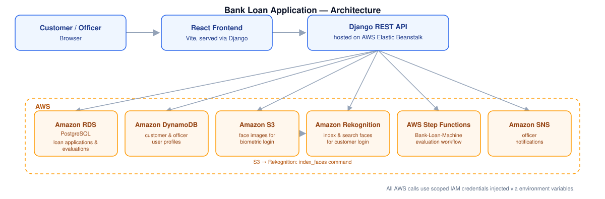

# Bank Loan Application

[](https://github.com/httpirsh/mecd-es-bank-application/actions/workflows/ci.yml)

A loan-application platform (Django REST API + React frontend) built as a software engineering coursework project, deployed on AWS.



## What it does

Handling loan applications by hand means manual verification, back-and-forth scheduling, and no clear audit trail. This project models that process end-to-end for two kinds of user:

- **Customers** simulate a loan (amount, duration, or a target monthly payment) to see the interest rate and repayment plan up front, log in with facial recognition instead of a password, and submit the application for review.
- **Bank officers** work through incoming applications and accept, reject, or request an interview — picking from available timeslots — with the system notifying them automatically when there's something new to act on.

The point of building it wasn't just "a CRUD app with a database" — it's a small but complete example of wiring a real workflow (identity verification, asynchronous evaluation, notifications) to managed AWS services instead of hand-rolling each piece.

## AWS architecture

| Service | Role in this project |
|---|---|
| **Elastic Beanstalk** | Hosts and deploys the Django application (`bank_django/.ebextensions`, `.elasticbeanstalk`) |
| **RDS (PostgreSQL)** | Relational store for loan simulations, applications, and evaluations |
| **DynamoDB** | Stores user profiles (username, contact info, role, face ID) for authentication |
| **S3** | Stores face images used for biometric login |
| **Rekognition** | Indexes and searches faces against an S3-backed collection to authenticate customers by face (`api/management/commands/index_faces.py`, `search_faces.py`) |
| **Step Functions** | Orchestrates the loan evaluation workflow (`Bank-Loan-Machine` state machine), triggered from the loan application API |
| **SNS** | Sends notifications to bank officers on loan evaluation events (`office/views.py`) |
| **IAM** | Scoped, temporary credentials injected via environment variables — nothing is hardcoded in the app |

## Stack

- **Backend**: Django, Django REST Framework, JWT authentication (`djangorestframework-simplejwt`), bcrypt for password hashing
- **Frontend**: React + Vite
- **Dev environment**: VS Code devcontainer

## Local development

Open the project in VS Code with the [Dev Containers](https://marketplace.visualstudio.com/items?itemName=ms-vscode-remote.remote-containers) extension — it builds the environment and installs dependencies automatically.

Credentials are never committed. Copy `.env.example` to `.env` and fill in your own values (or export the same variables in your shell before opening the devcontainer, since `devcontainer.json` reads them from the host via `${localEnv:...}`):

```sh
cp .env.example .env
# edit .env with your AWS credentials, RDS connection, and secrets
```

Then, from the repo root:

```sh
make django_start   # builds the frontend and runs the Django dev server
```

See `.env.example` for the full list of required variables (AWS credentials and region, RDS connection, Django and JWT secret keys, Step Functions state machine ARN).

## Tests

Backend tests run against a real PostgreSQL database and mock every AWS call (via [moto](https://github.com/getmoto/moto)), so nothing hits real AWS. CI (`.github/workflows/ci.yml`) runs them on every push and pull request against `main`, alongside a frontend build and lint check.

```sh
cd bank_django
python manage.py test api
```

## Deployment

```sh
make deploy   # builds the frontend and deploys to Elastic Beanstalk via the EB CLI
```
